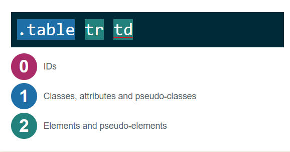

# What will specificity do for you <Badge text="#it's not working" />

###### 19.03.06

The other day I ran into a situation where a co-worker was not understanding how to override existing styles of an element. Instead of restoring to the evil !important statement, we took a deeper look at the code to undertand why.

## The setup

Here we have an innocent looking table set up...

```html
<table class="table">
  <tr class="row">
    <td>Apple</td>
    <td>Banana</td>
  </tr>
</table>
```

...along with the following css rule

```css
.table tr td {
  font-weight: bold;
  border-bottom: 1px solid black;
}
```

Which would result in something like this

<table class="table">
  <tr class="row">
    <td>Apple</td>
    <td>Banana</td>
  </tr>
</table>

<style>
.table .row td {
  font-weight: bold;
  border-bottom: 1px solid black;
}
</style>

## ...there was an attempt

Co-worker wanted to remove the the first underline on the apple and at first added a class to the table cell in question as so...

```html
<td class="custom-cell">Apple</td>
```

...and the css

```css
.custom-cell {
  border: none;
}
```

But what was the result? NOTHING HAPPENED. Ahhhh...one of those moments where you might be tempted to flip your table (╯°□°）╯︵ ┻━┻ but NO! There's a better way!

## ...whats the problem?

First, let's use this awesome [Specificity Calculator](https://specificity.keegan.st/) that can
help us determine what rules would take precedent. In case you didn't know, all the rules you write in css have a secret value (cardinality) to them. When two different styles affect the same element, the one that is more 'specific' a.k.a has the higher value, wins. Plugging in the tfirst value we



What you ca infer from the selector use here is that it has a value of 12. When compared to just the class rule being applied a value of 10, the first rule 'wins' as it has a higher value and is more 'specific'

## ...and the solution?

Understanding that you already have a rule that is in place requires a deeper understanding of what the intention was, perhaps your table should not be applying such generic and deep specificity. What you can do in this case is write a rule that is more specific sch as

## Moral of the story

Don't go for the easy solution. Be more specific so you're not breaking the code for the next person. This especially happens when we use third party UI frameworks that pretty much establish all the rules to be used, leaving it up to you to figure out how to write custom selectors that will place nice with everything.

-Zano
