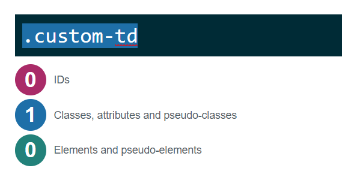
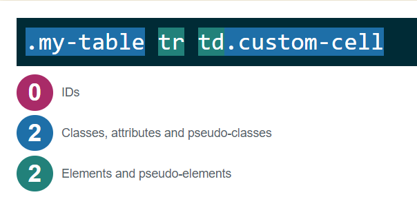

# {{$page.frontmatter.title}}
<Badge :text="$page.frontmatter.date" />
<Badge :text="$page.frontmatter.tag" />

The other day I ran into a situation where a co-worker was not understanding how to override existing styles of an element. Instead of restoring to the evil **!important** statement, we took a deeper look at the code to undertand what could be done.

## The setup

Here we have an innocent looking table set up...

```html
<table class="my-table">
  <tr>
    <td>Apple</td>
    <td>Banana</td>
  </tr>
</table>
```

...along with the following css rule...

```css
.my-table tr td {
  font-weight: bold;
  border-bottom: 1px solid black;
}
```

Which would result in something like this...

<table class="my-table">
  <tr>
    <td>Apple</td>
    <td>Banana</td>
  </tr>
</table>

<style>
.my-table tr td {
  font-weight: bold;
  border-bottom: 1px solid black;
}
</style>

## ...the change attempt

Co-worker wanted to remove the the first bottom border on the `apple` cell and added a class to the `td` element in question as so...

```html
<td class="custom-cell">Apple</td>
```

...and the css...

```css
.custom-cell { border: none; }
```

But what was the result? NOTHING CHANGED. The border was still there...

Ahhhhhh.....(╯°□°）╯︵ ┻━┻

You put a class DIRECTLY on the table cell you want to change and it didnt work! So infuriating, right?  Well guess what?  You did it wrong....

## ...whats the problem?

First, let's use this awesome [Specificity Calculator](https://specificity.keegan.st/) to help understand whats taking priority.  In case you didn't know, all the rules you write in css have a secret value (cardinality) to them. When two different styles affect the same element, the one that is more 'specific' a.k.a has the higher value, wins. Plugging in the first style selector of `.table tr td` to the calculator we get...


What you can infer from the selector is that it produces a value of 12. One class and two elements.  Whats the value of the `.custom-cell` class ?



... 10 ! and because 12 > 10 your conflicting properties will be overwritten, hence why `border: none` doesn't work.

## ...and the solution?

Understanding that you already have a rule is as simple as inspecting the element in your browser.  Once you identify the prob you can write a rule is in place requires a deeper understanding of what the intention was, perhaps your table should not be applying such generic and deep specificity. What you can do in this case is write a rule that is more specific sch as

```css
.my-table tr td.custom-cell{ border: none;}
```



## Moral of the story

Don't go for the easy solution. Be more specific so you're not breaking the code for the next person. This especially happens when we use third party UI frameworks that pretty much establish all the rules to be used, leaving it up to you to figure out how to write custom selectors that will place nice with everything.

-Zano
