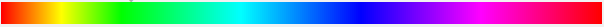

# {{$page.frontmatter.title}}

<Badge :text="$page.frontmatter.date" />
<Badge :text="$page.frontmatter.tag" />
<Tweet />

Creating colors that work well together is hard. We can use hex values or RGBa values like `#000` (hex) or `(0,0,0,1)` (RGBa) to get a black color and `#FFFFFF` or `(255,255,255,1)` to create white. Beyond that, changing any part of these values will most likely leave you guessing as to what color you've created. Enter HSLa... the more programmatic approach to creating colors.

## Hue, Saturation, Light, Alpha (HSLa)

Creating a color with HSLa consists of three parts as described in the table below:

| HSLa       | Description                                                                                                                                                                                                                                                                   |
| ---------- | ----------------------------------------------------------------------------------------------------------------------------------------------------------------------------------------------------------------------------------------------------------------------------- |
| Hue        | A degree value from 0 - 360 which comes from the following color wheel range (displayed in linear fashion).  Values near 0 or 360 will result in reds. Around 120's you have greens and around 240's you have blues |
| Saturation | A percentage value from 0 - 100%. Represents how 'strong' the color would be, a value of `0` would leave you with no color (gray) and `100%` would be a very vibrant version of the color.                                                                                    |
| Light      | A percentage value from 0 - 100%. A value of 0 represents no light at all, meaning you would get black. 100% means too much light and results in a white. Think of this value as what would happen if you move a flashlight towards and away from your color                  |
| Alpha      | A value between 0 and 1 or percentage from 0% - 100%. Determins how 'see-through' (opaque) your value is.                                                                                                                                                                     |

<style>
.wt{color:white;}
.blue-1{background-color:hsla(240, 100%, 50%, 1);}
.blue-2{background-color:hsla(240, 100%, 70%, 1);}
.blue-3{background-color:hsla(240, 100%, 30%, 1);}

.red-1{background-color:hsla(0, 100%, 50%, 1);}
.red-2{background-color:hsla(0, 100%, 70%, 1);}
.red-3{background-color:hsla(0, 100%, 30%, 1);}

.green-1{background-color:hsla(120, 100%, 50%, 1);}
.green-2{background-color:hsla(120, 100%, 70%, 1);}
.green-3{background-color:hsla(120, 100%, 30%, 1);}

/* ======= */

.blue-1.bm{background-color:hsla(240, 100%, 50%, 1);}
.blue-2.bm{background-color:hsla(240, 100%, 50%, 1);}
.blue-3.bm{background-color:hsla(240, 100%, 50%, 1);}

.red-1.bm{background-color:hsla(0, 50%, 50%, 1);}
.red-2.bm{background-color:hsla(0, 100%, 50%, 1);}
.red-3.bm{background-color:hsla(0, 20%, 50%, 1);}

.green-1.bm{background-color:hsla(120, 100%, 50%, 1);}
.green-2.bm{background-color:hsla(120, 100%, 50%, 1);}
.green-3.bm{background-color:hsla(120, 100%, 50%, 1);}
</style>

Putting it all together this is how you might create the color black:

```css
color: hsla(0, 0%, 0%, 1); //black because there is no light value.
```

...and the color white

```css
color: hsla(0, 0%, 100%, 1); //white because your light value is 100%
```

So now if you were asked for a light blue color you could already imagine a path to the color by first starting with a normal blue with full saturation and even amount of light

```css
color: hsla(240, 100%, 50%, 1); /* your standard blue */
```

<span class="blue-2 white-text">hsla(240, 100%, 30%, 1)</span>
<span class="blue-1 white-text">hsla(240, 100%, 50%, 1)</span>
<span class="blue-3 white-text">hsla(240, 100%, 70%, 1)</span>

Light to Dark

| Color | Light                                                    | Normal                                                  | Dark                                                    |
| ----- | -------------------------------------------------------- | ------------------------------------------------------- | ------------------------------------------------------- |
| Red   | <span class="red-2 wt ">hsla(0, 100%, 30%, 1)</span>     | <span class="red-1 wt">hsla(0, 100%, 50%, 1)</span>     | <span class="red-3 wt">hsla(0, 100%, 70%, 1)</span>     |
| Green | <span class="green-2 wt ">hsla(120, 100%, 30%, 1)</span> | <span class="green-1 wt">hsla(120, 100%, 50%, 1)</span> | <span class="green-3 wt">hsla(120, 100%, 70%, 1)</span> |
| Blue  | <span class="blue-2 wt">hsla(240, 100%, 30%, 1)</span>   | <span class="blue-1 wt">hsla(240, 100%, 50%, 1)</span>  | <span class="blue-3 wt">hsla(240, 100%, 70%, 1)</span>  |

Bright to muted

| Color | Light                                                      | Normal                                                     | Dark                                                       |
| ----- | ---------------------------------------------------------- | ---------------------------------------------------------- | ---------------------------------------------------------- |
| Red   | <span class="red-2 wt bm">hsla(0, 100%, 30%, 1)</span>     | <span class="red-1 wt bm">hsla(0, 100%, 50%, 1)</span>     | <span class="red-3 wt bm">hsla(0, 100%, 70%, 1)</span>     |
| Green | <span class="green-2 wt bm">hsla(120, 100%, 30%, 1)</span> | <span class="green-1 wt bm">hsla(120, 100%, 50%, 1)</span> | <span class="green-3 wt bm">hsla(120, 100%, 70%, 1)</span> |
| Blue  | <span class="blue-2 wt bm">hsla(240, 100%, 30%, 1)</span>  | <span class="blue-1 wt bm">hsla(240, 100%, 50%, 1)</span>  | <span class="blue-3 wt bm">hsla(240, 100%, 70%, 1)</span>  |

Here the hue value is set to 0, meaning red. Our saturation value is 0% which would remove all color and leave us with gray despite the red color declaration. The light value is ultimately the strongest factor here and with 0% (no light), you get darkness, a.k.a black.

## Benefits

Imagine if someone asks you, "I need a blue and orange color that work well together. You could more easily do that by finding your blue color first by selecting a hue value from the color wheel range. Now for the saturation and light value you are no longer 'guessing' but 'adjusting' to your liking. When you create the orange color, they only thing you will need to technically change is the hue value since you've already established a saturation and light value that work together, neat!

## But I already know hex values and RGBa..

Ok, can you make
Yes, but if I have you two random colors, could you then modify the value to lighten the color ?

```css
color: hsla(20, 50%, 50%, 1);
```

Its supported in all the major browsers.
